# Cobertura de código de JaCoCo con Spring Boot

La estructura del proyecto base que se utiliza aquí está tomado del proyecto que trabajamos en el curso de **Andrés
Guzmán**, mismo que está alojado en el siguiente repositorio
[spring-boot-test](https://github.com/magadiflo/spring-boot-test.git).

Sobre el tema de `JaCoCo` que se aborda en este proyecto y los distintos ejemplos, es fruto de la investigación
que hice sobre el tema.

**Fuente**

- [JaCoCo Code Coverage with Spring Boot (Truong Bui - medium)](https://medium.com/@truongbui95/jacoco-code-coverage-with-spring-boot-835af8debc68)

---

## Dependencias iniciales

A continuación se muestra todo el archivo `pom.xml` con el que está construido el proyecto inicialmente.

````xml
<?xml version="1.0" encoding="UTF-8"?>
<project xmlns="http://maven.apache.org/POM/4.0.0" xmlns:xsi="http://www.w3.org/2001/XMLSchema-instance"
         xsi:schemaLocation="http://maven.apache.org/POM/4.0.0 https://maven.apache.org/xsd/maven-4.0.0.xsd">
    <modelVersion>4.0.0</modelVersion>
    <parent>
        <groupId>org.springframework.boot</groupId>
        <artifactId>spring-boot-starter-parent</artifactId>
        <version>3.3.2</version>
        <relativePath/> <!-- lookup parent from repository -->
    </parent>
    <groupId>dev.magadiflo</groupId>
    <artifactId>spring-boot-test-jacoco</artifactId>
    <version>0.0.1-SNAPSHOT</version>
    <name>spring-boot-test-jacoco</name>
    <description>Demo project for Spring Boot</description>
    <properties>
        <java.version>21</java.version>
    </properties>
    <dependencies>
        <dependency>
            <groupId>org.springframework.boot</groupId>
            <artifactId>spring-boot-starter-data-jpa</artifactId>
        </dependency>
        <dependency>
            <groupId>org.springframework.boot</groupId>
            <artifactId>spring-boot-starter-web</artifactId>
        </dependency>

        <!--Manual-->
        <dependency>
            <groupId>org.springdoc</groupId>
            <artifactId>springdoc-openapi-starter-webmvc-ui</artifactId>
            <version>2.6.0</version>
        </dependency>
        <!--/Manual-->
        <dependency>
            <groupId>org.springframework.boot</groupId>
            <artifactId>spring-boot-starter-webflux</artifactId>
            <scope>test</scope>
        </dependency>
        <dependency>
            <groupId>com.mysql</groupId>
            <artifactId>mysql-connector-j</artifactId>
            <scope>runtime</scope>
        </dependency>
        <dependency>
            <groupId>org.projectlombok</groupId>
            <artifactId>lombok</artifactId>
            <optional>true</optional>
        </dependency>
        <dependency>
            <groupId>org.springframework.boot</groupId>
            <artifactId>spring-boot-starter-test</artifactId>
            <scope>test</scope>
        </dependency>
    </dependencies>

    <build>
        <plugins>
            <plugin>
                <groupId>org.springframework.boot</groupId>
                <artifactId>spring-boot-maven-plugin</artifactId>
                <configuration>
                    <excludes>
                        <exclude>
                            <groupId>org.projectlombok</groupId>
                            <artifactId>lombok</artifactId>
                        </exclude>
                    </excludes>
                </configuration>
            </plugin>
        </plugins>
    </build>

</project>
````

## ¿Qué es JaCoCo?

Estoy bastante seguro de que cada uno de nosotros ha escrito y seguirá escribiendo `pruebas unitarias` en sus proyectos.
Las `pruebas unitarias` desempeñan un papel muy importante, ya que las empleamos para probar cada fragmento de código,
función, método y más.

Una vez finalizada la redacción de las `pruebas unitarias`, es esencial ver cuánto cubrieron el código las pruebas e
identificar áreas que requieren pruebas adicionales. Hacemos todo esto para asegurarnos de que el código de la
aplicación esté completamente probado y listo para su implementación.

`JaCoCo (Java Code Coverage)` es una herramienta que se utiliza para medir la cobertura de código en proyectos Java. La
cobertura de código es una métrica que indica qué partes de tu código han sido ejecutadas durante las pruebas
automatizadas. `JaCoCo` te ayuda a identificar áreas no cubiertas por pruebas, lo que puede ser crucial para mejorar la
calidad y la robustez del software.

## Características de JaCoCo

- Realizar análisis de cobertura de instrucciones, ramas, líneas, métodos y complejidad ciclomática del código.
- Integración simple por medio de agente de java.
- Compatible con todas las versiones de archivos de clase Java publicadas.
- Se puede user para tareas en Ant y Maven.

## Agrega plugin de JaCoCo

Necesitamos definir el plugin `Maven` de `JaCoCo` en el archivo `pom.xml`.

````xml

<plugin>
    <groupId>org.jacoco</groupId>
    <artifactId>jacoco-maven-plugin</artifactId>
    <version>0.8.12</version>
    <executions>
        <execution>
            <goals>
                <goal>prepare-agent</goal>
            </goals>
        </execution>
        <execution>
            <id>report</id>
            <phase>test</phase>
            <goals>
                <goal>report</goal>
            </goals>
        </execution>
    </executions>
</plugin>
````

**DONDE**

- `<executions>`, esta sección define las diferentes ejecuciones del plugin que se van a realizar en diferentes fases
  del `ciclo de vida de Maven`. Cada ejecución puede tener uno o más objetivos `(goals)` que especifican las tareas que
  debe realizar el plugin.


- `<execution>`, define una ejecución específica del plugin. En este caso, hay dos ejecuciones diferentes: una para
  `preparar el agente de cobertura` y otra para `generar el reporte`.


- `<goals>`, dentro de cada ejecución, se define una o más objetivos `(goals)` que se deben realizar. Un objetivo es una
  acción que el plugin lleva a cabo durante la ejecución.


- `<goal>prepare-agent</goal>`, este objetivo `(prepare-agent)` prepara el agente de `JaCoCo` para recopilar datos de
  cobertura durante la ejecución de las pruebas. Básicamente, `JaCoCo` instrumenta el código para rastrear qué líneas y
  ramas del código se ejecutan.


- `<id>report</id>`, asigna un identificador único (id) a esta ejecución específica del plugin. Aquí, la ejecución se
  denomina `report`, ya que se encarga de generar el informe de cobertura.


- `<phase>test</phase>`, especifica la `fase del ciclo de vida de Maven` en la que se ejecutará esta configuración. La
  fase `test` es donde se ejecutan las `pruebas unitarias`. Aquí, la generación del informe de cobertura se realiza
  justo después de que se ejecutan las pruebas.


- `<goal>report</goal>`, este objetivo `(report)` genera un informe de cobertura de código utilizando los datos
  recopilados por el agente. El informe se generará en la carpeta `target/site/jacoco`.

**Resumen**

- `Primera ejecución (prepare-agent)`: Se encarga de preparar el agente de `JaCoCo` antes de la ejecución de las pruebas
  para que pueda recopilar datos de cobertura.
- `Segunda ejecución (report)`: Después de que se ejecutan las pruebas en la fase test, esta ejecución genera un informe
  detallado de la cobertura de código.

Esta configuración es básica pero suficiente para integrar `JaCoCo` en un proyecto de `Spring Boot` y generar informes
de cobertura después de ejecutar las pruebas automatizadas.

## Ejecutando Test Unitarios y Revisando Reporte de JaCoCo

Al ejecutar las pruebas con `JUnit`, se activará automáticamente el agente `JaCoCo`. Este creará un informe de
cobertura en formato binario en el directorio de destino, `target/jacoco.exec`.

Obviamente, no podemos interpretar el resultado por nuestra cuenta, pero otras herramientas y complementos sí pueden
hacerlo, por ejemplo, `Sonar Qube`.

La buena noticia es que adicionalmente se nos va a crear un directorio en `target/site/jacoco/` donde encontraremos
los informes de cobertura de código legibles en varios formatos, como `html`, `csv` y `xml`.

En este proyecto, actualmente tengo dos clases de prueba `AccountServiceImplTest` y `AccountControllerTest`. Estas
clases de prueba tienen implementadas distintos test unitarios correspondientes a la clase de servicio y al controlador
respectivamente.

Así que, ejecutaremos los test, ya sea usando el `IDE IntelliJ IDEA` o mediante consola. En mi caso usaré la consola
para la ejecución de todos los test unitarios.

````bash
$ mvn clean test
````

Luego de ejecutar el comando anterior, vemos que todos los test han pasado exitosamente.

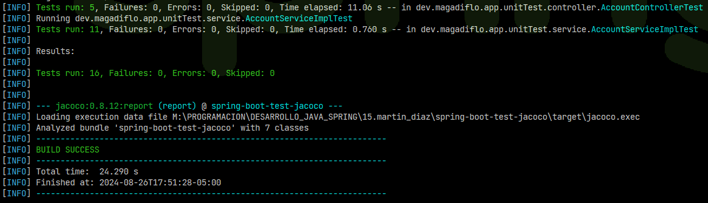

Lo que a nosotros nos interesa en este proyecto es ver la cobertura de código que estamos abarcando, así que, luego
de ejecutar los test, necesitamos ver el reporte que nos genera `JaCoCo`.

Antes de ver el reporte generado por `JaCoCo`, veamos el directorio `/target` que se nos genera con los distintos
archivos.

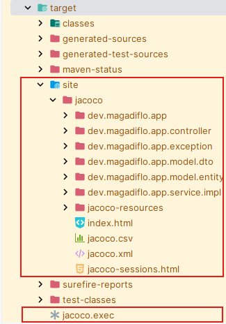

Ahora, para ver el reporte, abrimos el archivo `target/site/jacoco/index.html` en el navegador.

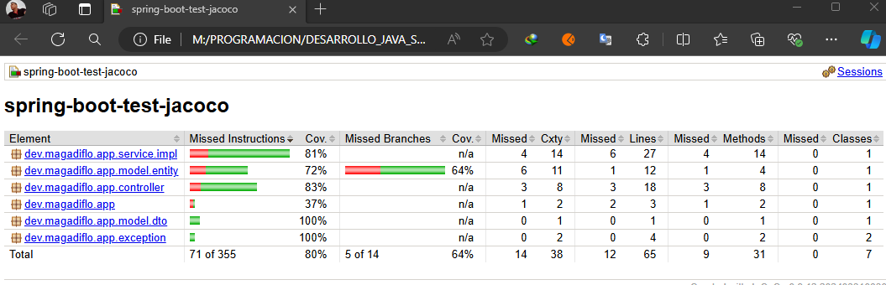

En la imagen se puede ver que `sping-boot-test-jacoco` es el nombre del proyecto y `dev.magadiflo.app` es el paquete.
Se muestra que el código se ha cubierto en un `80%` y las ramas en un `64%`. Para obtener más detalles sobre las
propiedades de Jacoco, puede consultar este recurso: Contadores de cobertura.

Abra el paquete `dev.magadiflo.app.service.impl`, tenemos una clase `AccountServiceImpl`. En su interior, el código se
ha cubierto en un `81%` y sin ramas que evaluar.

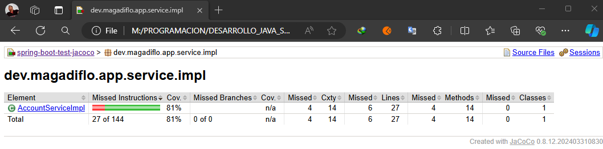

Ingresamos dentro de la clase `AccountServiceImpl` y observemos que hay métodos que están con `0%` de cobertura.

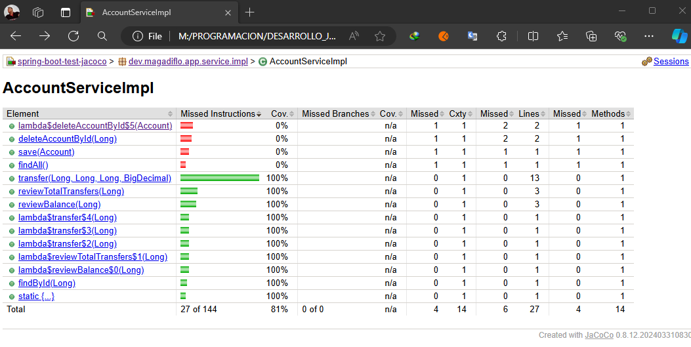

A continuación abramos el método `deleteAccountById(Long)` y observemos cómo nos lo muestra `JaCoCo`.

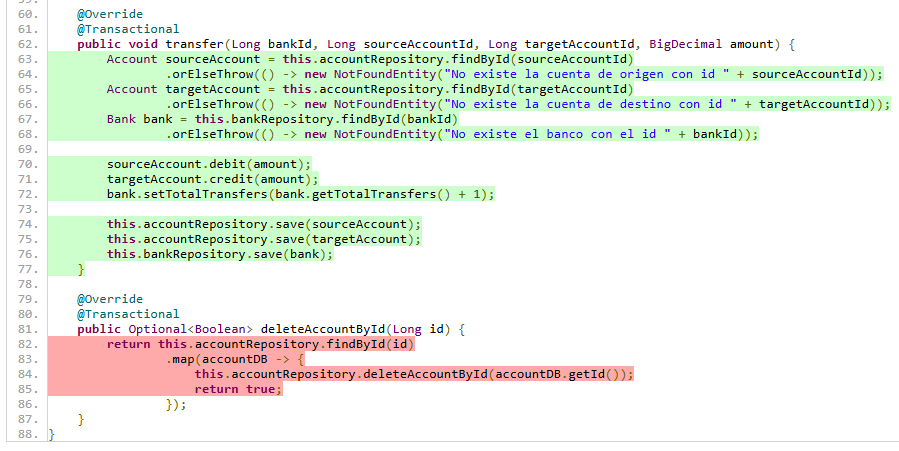

Si observamos la imagen anterior, el método `deleteAccountById()` está con fondo rojo, lo cual nos indica que ese bloque
de código no está probado, mientras que si observamos el método `transfer()`, vemos que todo está con fondo verde
indicándonos que todo ese código sí está probado.

## Análisis del reporte

Los informes de `JaCoCo` nos ayudan a analizar visualmente la cobertura del código mediante el uso de rombos con colores
para las ramas y colores de fondo para las líneas:

- El `diamante rojo` significa que no se han probado ramas durante la fase de prueba.
- El `diamante amarillo` muestra que el código está parcialmente cubierto (algunas ramas no se han probado).
- El `diamante verde` significa que se han cubierto todas las ramas durante la prueba.

El mismo código de color se aplica al color de fondo, pero para la `cobertura de líneas`.

`JaCoCo` proporciona principalmente tres métricas importantes:

- La `cobertura de líneas` refleja la cantidad de código que se ha cubierto en función de la cantidad de instrucciones
  de código de bytes de Java llamadas por las pruebas.
- La `cobertura de ramas` muestra el porcentaje de ramas cubiertas en el código, generalmente relacionadas con las
  instrucciones `if/else y switch`.
- La `complejidad ciclomática` refleja la complejidad del código al proporcionar la cantidad de rutas necesarias para
  cubrir todas las rutas posibles en un código a través de una combinación lineal.

Para tomar un ejemplo trivial, si no hay instrucciones `if` o `switch` en el código, la `complejidad ciclomática` será
`1`, ya que solo necesitamos una ruta de ejecución para cubrir todo el código.

En general, la `complejidad ciclomática` refleja la `cantidad de casos de prueba` que necesitamos implementar para
cubrir todo el código.

## Puntuación de cobertura de código

Ahora que sabemos un poco sobre cómo funciona `JaCoCo`, mejoremos nuestra puntuación de cobertura de código.

Para lograr una cobertura de código del `100%`, necesitamos introducir pruebas que cubran las partes faltantes que se
muestran en el informe inicial. Solo vamos a trabajar con la clase `AccountServiceImpl` para lograr el `100%` de la
cobertura de código de dicha clase. Entonces, si revisamos el resultado anterior de la clase `AccountServiceImpl`, nos
habremos dado cuenta de que hubo 3 métodos a los que no se les hizo su test, por lo tanto, a continuación procedemos
a subsanar dicho inconveniente.

````java

@ExtendWith(MockitoExtension.class)
class AccountServiceImplTest {

    /* other codes: properties, test methods */

    @Test
    void shouldFindAllAccounts() {
        // given
        List<Account> accounts = List.of(this.sourceAccount, this.targetAccount);
        when(this.accountRepository.findAll()).thenReturn(accounts);

        // when
        List<Account> accountList = this.accountService.findAll();

        // then
        assertFalse(accountList.isEmpty());
        assertEquals(accounts.size(), accountList.size());
        verify(this.accountRepository).findAll();
    }

    @Test
    void shouldSaveAnAccount() {
        // given
        Account accountToSave = Account.builder()
                .person("Milagros")
                .balance(new BigDecimal("2500"))
                .build();
        when(this.accountRepository.save(any(Account.class))).then(invocation -> {
            Account account = invocation.getArgument(0);
            account.setId(1L);
            return account;
        });

        // when
        Account accountDB = this.accountService.save(accountToSave);

        // then
        assertNotNull(accountDB);
        assertNotNull(accountDB.getId());
        assertEquals(1L, accountDB.getId());
        assertEquals(accountToSave.getPerson(), accountDB.getPerson());
        assertEquals(accountToSave.getBalance().doubleValue(), accountDB.getBalance().doubleValue());
        verify(this.accountRepository).save(any(Account.class));
    }

    @Test
    void shouldDeleteAnAccount() {
        // given
        Long accountToDeleteId = 1L;
        when(this.accountRepository.findById(accountToDeleteId)).thenReturn(Optional.of(this.sourceAccount));
        when(this.accountRepository.deleteAccountById(accountToDeleteId)).thenReturn(1);

        // when
        Optional<Boolean> wasDeleted = this.accountService.deleteAccountById(accountToDeleteId);

        // then
        assertTrue(wasDeleted.isPresent());
        verify(this.accountRepository).findById(accountToDeleteId);
        verify(this.accountRepository).deleteAccountById(accountToDeleteId);
    }

    @Test
    void shouldReturnOptionalEmptyWhenDeleteAnAccountThatDoesNotExit() {
        // given
        Long accountToDeleteId = 1L;
        when(this.accountRepository.findById(accountToDeleteId)).thenReturn(Optional.empty());

        // when
        Optional<Boolean> wasDeleted = this.accountService.deleteAccountById(accountToDeleteId);

        // then
        assertTrue(wasDeleted.isEmpty());
        verify(this.accountRepository).findById(accountToDeleteId);
        verify(this.accountRepository, never()).deleteAccountById(anyLong());
    }
}
````

Con respecto al método `deleteAccountById()`, se ha creado dos métodos test para evaluar dos posibles escenarios, la
primera cuando la cuenta sí existe y la segunda cuando no existe.

Ahora, procedemos a ejecutar nuestros test con el comando de maven `mvn clean test`.

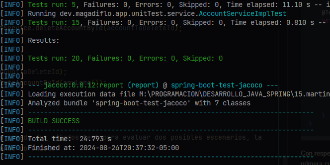

Finalmente, revisamos la cobertura de prueba para la clase `AccountServiceImpl`. Nos podemos dar cuenta que ahora sí
estamos cumpliendo el `100%` de la cobertura de código.

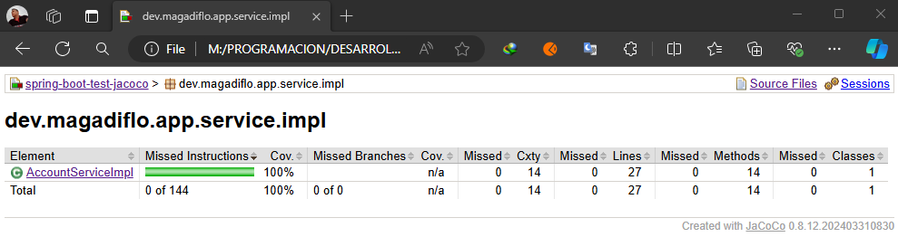

Si ingresamos dentro de la clase veremos que todos los métodos están cumpliendo el `100%`.

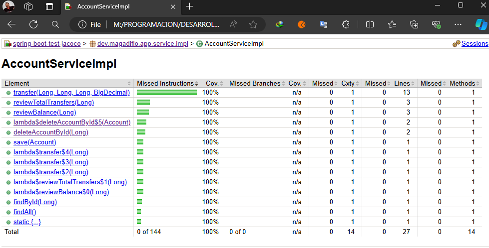

Incluso, si ingresamos dentro de uno de los métodos, podremos ver todos ellos que están con el fondo verde, lo que nos
indica que estamos cubriendo el 100% de la cobertura de código para esta clase.

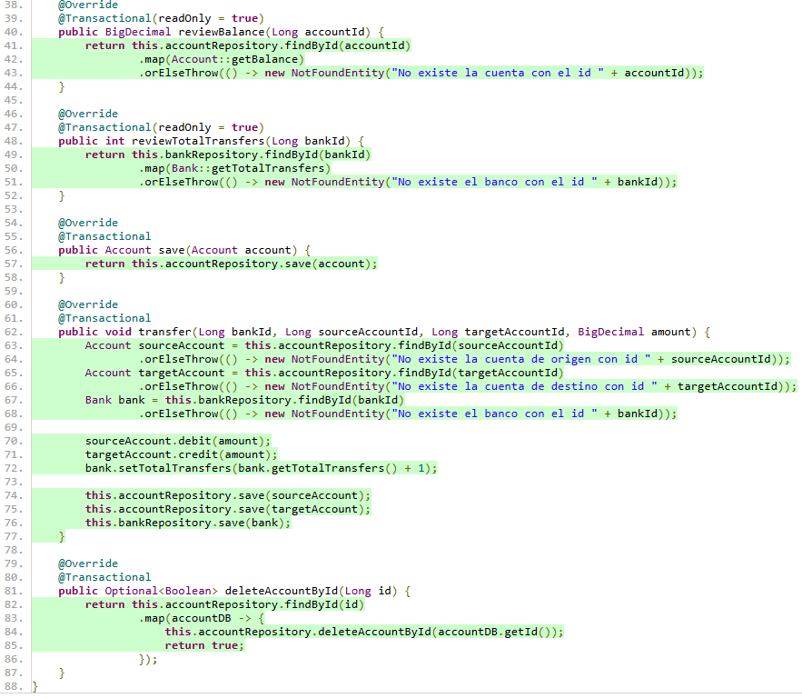

## Excluye clases de la cobertura de código

Es posible que observe que la clase `SpringBootTestApplication` (clase principal de la aplicación) no es muy crítica
para los informes de cobertura. En algunos casos, la cobertura de estas clases puede sesgar el informe general de
cobertura de código.

En la siguiente imagen, vemos que efectivamente, el paquete `dev.magadiflo.app` se está tomando como parte de la
cobertura de código, aunque en realidad lo que se está tomando es el contenido dentro de ese paquete.

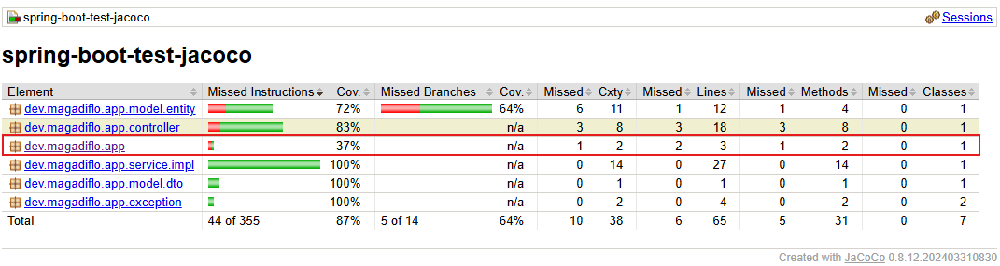

Si accedemos dentro del paquete anterior, podemos observar que se está tomando la clase principal de la aplicación
`SpringBootTestApplication` como parte de la evaluación de la cobertura de código.

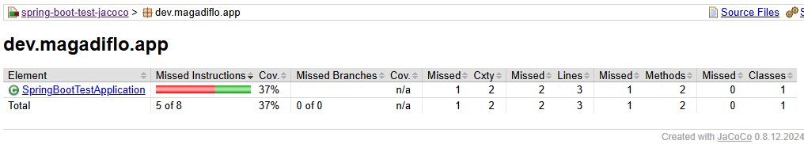

Entonces, para evitar que estas clases irrelevantes afecten a la cobertura del código, podemos excluirlas
utilizando el plugin `Jacoco`. Para eso, en el `pom.xml` agregaremos la etiqueta `<configuration>` y dentro de él, 
en una etiqueta `<exclude>` la clase compilada en `bytecode`.

````xml

<plugin>
    <groupId>org.jacoco</groupId>
    <artifactId>jacoco-maven-plugin</artifactId>
    <version>0.8.12</version>
    <configuration>
        <excludes>
            <exclude>dev/magadiflo/app/SpringBootTestApplication.class</exclude>
        </excludes>
    </configuration>
    ...
</plugin>
````

A continuación procedemos a ejecutar los test con el comando `mvn clean test`, revisamos el reporte y observamos que ya
no está el paquete `dev.magadiflo.app`. Recordemos que dentro de dicho paquete está la clase que acabamos de excluir.

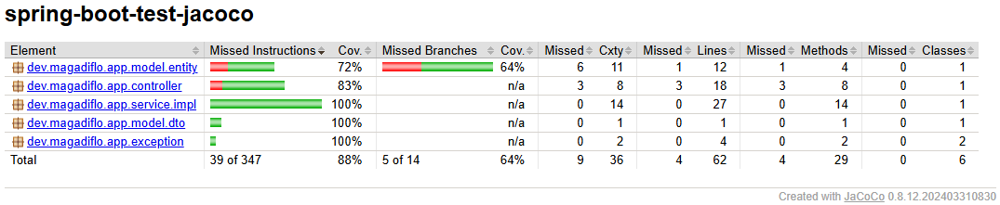